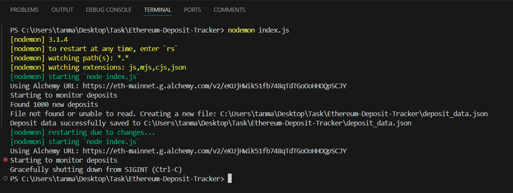
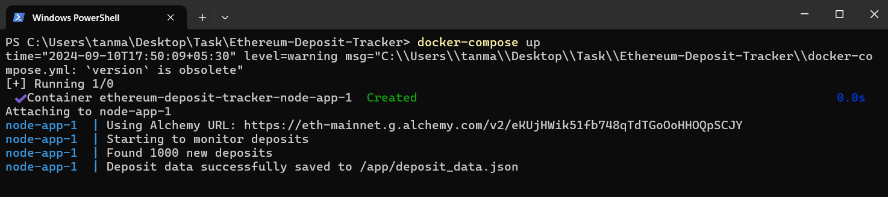
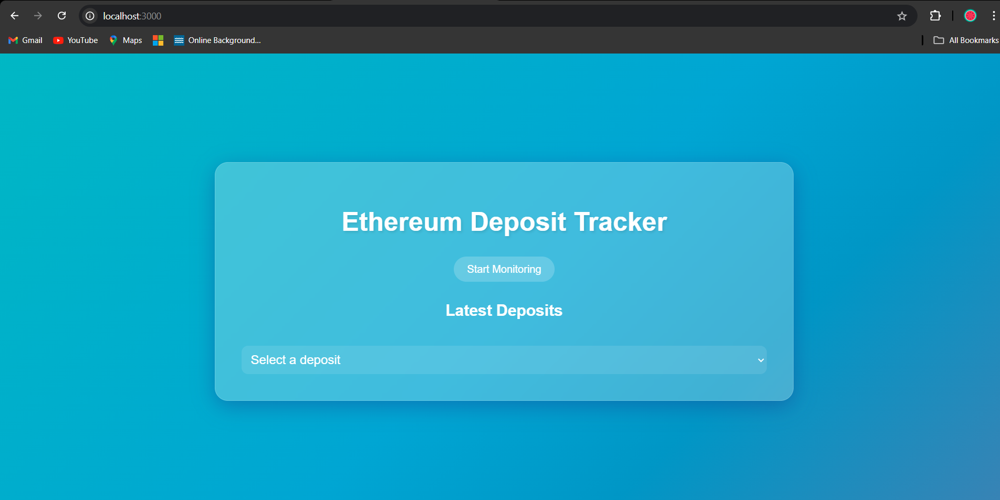
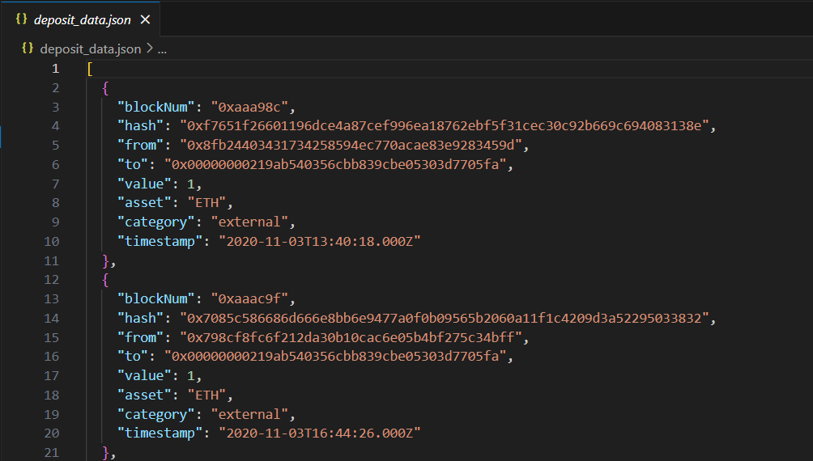
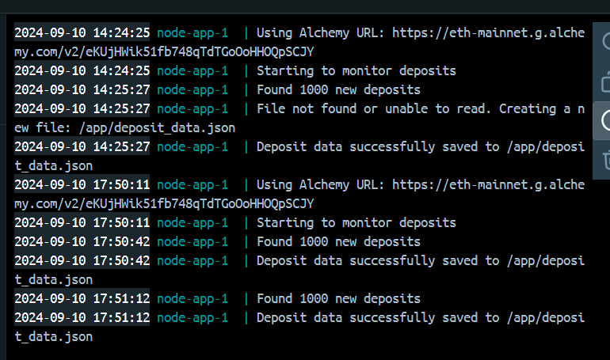

# Ethereum Deposit Tracker

## Overview

The Ethereum Deposit Tracker is a tool designed to monitor deposits on the Beacon Deposit Contract and store related block data. The project utilizes Node.js and Docker for a seamless setup and deployment experience.

## Table of Contents
- [Project Structure](#project-structure)
- [Prerequisites](#prerequisites)
- [Installation](#installation)
- [Usage](#usage)
  - [Running with Node.js](#running-with-nodejs)
  - [Running with Docker](#running-with-docker)
  - [Running with Frontend](#running-with-frontend)
- [Usage Instructions](#usage-instructions)
- [Examples](#examples)
  - [Example 1](#example-1-Viewing-Deposit-Data)
  - [Example 2](#example-2-Checking-Logs)
- [Troubleshooting](#troubleshooting)

## Project Structure

```
Ethereum-Deposit-Tracker/
├── node_modules/
├── index.js
├── .env
├── deposit_data.json
├── package.json
├── package-lock.json
├── Dockerfile
├── docker-compose.yml
└── README.md
```

- `index.js`: Main script for monitoring Ethereum deposits
- `.env`: Environment configuration file
- `deposit_data.json`: JSON file storing deposit data
- `Dockerfile`: Instructions for building the Docker image
- `docker-compose.yml`: Docker Compose configuration file


## Prerequisites

- Node.js (v14 or later)
- npm (v6 or later)
- Docker (optional, for containerized deployment)
- Alchemy API key

## Installation

1. Clone the repository:
   ```
   git clone https://github.com/Tanmay4803/Ethereum-Deposit-Tracker.git
   cd Ethereum-Deposit-Tracker
   ```

2. Install dependencies:
   ```
   npm install
   ```

## Usage

### Running with Node.js

To start the Ethereum Deposit Tracker:

```
node index.js
```

The script will run continuously, checking for new deposits every minute and saving the data to `deposit_data.json`.



### Running with Docker

1. **Start the Application:**

    ```bash
    docker-compose up
    ```

    This command will start the application in the background, and you can monitor its logs for activity.



2. **Check Logs:**

    To view the logs of the running Docker containers, use:

    ```bash
    docker-compose logs
    ```
   This command runs the container in detached mode, uses the environment variables from your `.env` file, and mounts the `deposit_data.json` file to persist data between container restarts.


Alternatively, you can use Docker Compose:

1. Ensure your `docker-compose.yml` file is correctly configured.

2. Run the following command:
   ```
   docker-compose up -d
   ```

To stop the container:
```
docker-compose down
```

### Running with Frontend

1. Run the following command:
```
  cd website
```
2. Run the following command:
```
  npm i
```
3. To start the Ethereum Deposit Tracker Website, run the:
```
  node website.js
```
4. Click the Start Monitoring button on the website at address (https://localhost:3000).

The script will run continuously, checking for new deposits every minute and saving the data to `data.json`.



## Usage Instructions

1. **Monitoring Ethereum Deposits:**

    The application will automatically start monitoring the Beacon Deposit Contract for any deposits on the configured Ethereum network. Deposits and related block data will be stored as per the application's implementation.

2. **Check Logs for Activity:**

    Logs will provide information about the ongoing monitoring process, including any deposits detected and any errors encountered.

3. **Stopping the Application:**

    - **Using Docker:**

      ```bash
      docker-compose down
      ```

      This command will stop and remove the Docker containers.

    - **Locally (Without Docker):**

      Stop the application by pressing `Ctrl+C` in the terminal where `npm start` was run.

## Examples

### Example 1: Viewing Deposit Data

After running the application for some time, you can view the collected deposit data:

```bash
cat deposit_data.json
```

This will display the JSON data of all tracked deposits, which might look like this:

```json
[
  {
    "blockNum": "0xc1234",
    "hash": "0x1234...",
    "from": "0xabcd...",
    "to": "0x00000000219ab540356cBB839Cbe05303d7705Fa",
    "value": "32000000000000000000",
    "asset": "ETH",
    "category": "external",
    "timestamp": "2023-01-01T12:00:00Z"
  },
]
```


### Example 2: Checking Logs

When running with Docker, you can check the logs to see the application's activity:

```bash
docker-compose logs -f
```

You might see output like this:

```
eth-deposit-tracker    | Starting to monitor deposits
eth-deposit-tracker    | Using Alchemy URL: https://eth-mainnet.alchemyapi.io/v2/your-api-key
eth-deposit-tracker    | Found 100 new deposits
eth-deposit-tracker    | Deposit data successfully saved to /app/deposit_data.json
```


## Troubleshooting

- **Dependency Issues:**

  If encountering issues with Node.js dependencies, run:

  ```bash
  npm install
  ```

